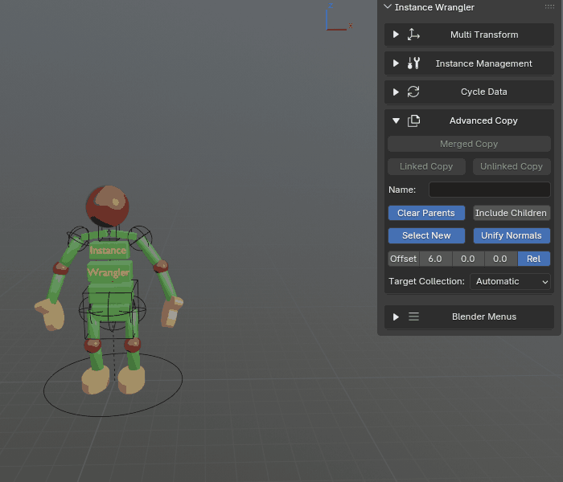
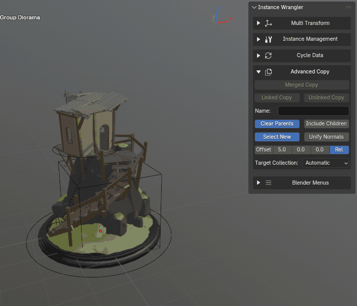
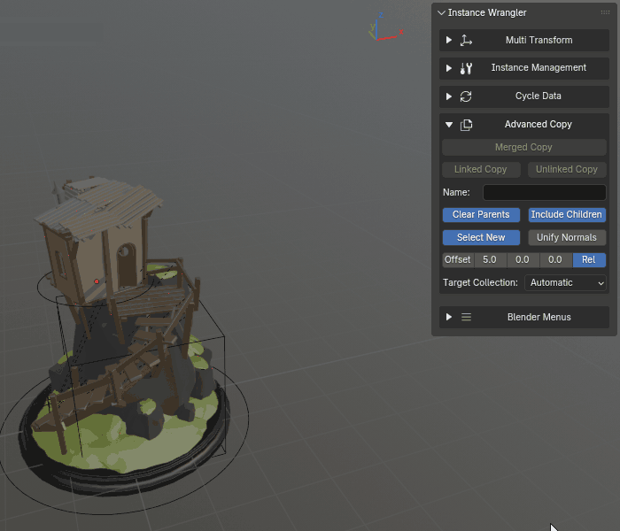
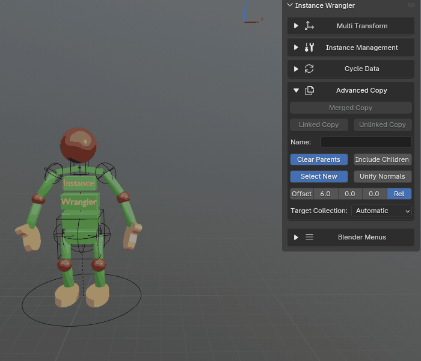
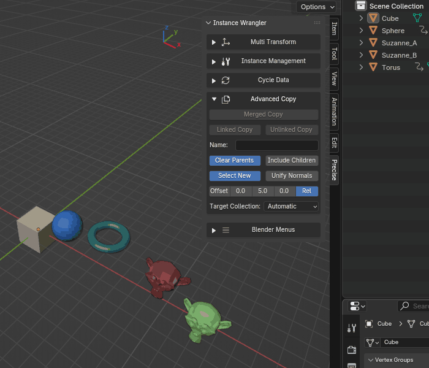
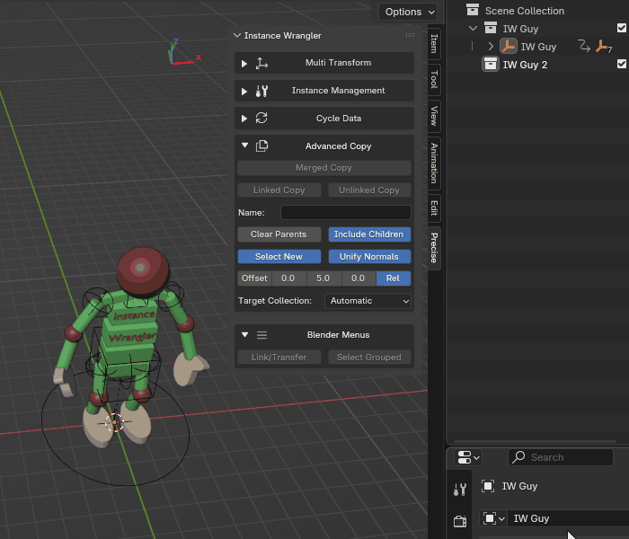

.. _advancedcopy:

==============
Advanced Copy
==============

.. raw:: html

    <iframe width="700" height="395" src="https://www.youtube.com/embed/qatFMOQRPq0?si=e2IZhFL9TTKon3Xk" title="YouTube video player" frameborder="0" allow="accelerometer; autoplay; clipboard-write; encrypted-media; gyroscope; picture-in-picture; web-share" referrerpolicy="strict-origin-when-cross-origin" allowfullscreen></iframe>

The **Advanced Copy** toolkit provides three powerful operators for creating new objects from your selection: **Merged Copy**, **Linked Copy**, and **Unlinked Copy**.

* **Merged Copy** is used to create a single, new mesh from a potentially diverse selection of objects.
    * **Target Merge Mode:** An alternative workflow that merges the selection directly into an existing object's data-block, updating all of its linked instances in the scene without creating a new object.
* **Linked Copy** is used to create new linked duplicates (instances) of your selection, with advanced options for placement and hierarchy.
* **Unlinked Copy** is used to create new unlinked duplicates (copies) of your selection, with advanced options for placement and hierarchy.

All three operators share a set of common options for controlling the placement, parenting, collection, and final selection state of the newly created objects.

.. figure:: images/advancedCopy_Overview.gif
    :align: center

*Advanced copy will effortlessly copy or merge any type of object with ultimate control over the newly created object.*

.. _mergedcopy:

Merged Copy
===========

The **Merged Copy** operator is a comprehensive tool for creating a **single, clean, game-ready mesh** from a selection of multiple, potentially diverse objects (meshes, curves, surfaces, text objects and grease pencil objects). It automates the process of duplicating, converting, joining, and positioning objects. This is ideal for creating simplified proxy models, preparing assets for game engines, or combining parts for 3D printing.

Its behavior is controlled by its unique options and the settings in the **Advanced Copy Settings** section below.

Defining the Origin (Pivot Point)
---------------------------------

The origin of the new merged object is determined by your selection:

* If you have a valid **active object** in your selection, its world-space location is used as the pivot point.
* If there is no valid active object, the origin is set to the **center of the new mesh's bounding box**.

*The pivot is determined by the active object or lack thereof.*

Target Merge Mode
-----------------

By default, **Merged Copy** creates a new object. **Target Merge Mode** is an alternative workflow that merges the selection directly *into an existing object's data-block*, updating all of its linked instances in the scene without creating a new object.

**Setting a target:**

Before clicking **Merged Copy**, click the **Set Target** button. This stores the currently active object as the merge target. Once set, the button area changes to show:

* **T: {object name}** — clicking this selects and activates the target object in the viewport.
* **X** — clears the target, returning to normal Merged Copy behaviour.

**What happens when a target is set:**

When you run **Merged Copy** with a target set, the merged geometry replaces the target object's data-block. Every other object in the scene that shares the same data-block (i.e. all linked instances of the target) is updated automatically. The target object itself keeps its name, parent, collection, and all other properties — only its mesh data changes.

.. note::
   The redo/F9 panel hides all settings when a target is set, to prevent confusion around what each setting does in this mode. The settings are still read from the values last set in the sidebar or popup. Most settings apply normally to the merge operation itself. The two exceptions are **Clear Parents** and **Target Collection**, which have no effect — the merged object container is discarded after the data-block transfer, so parenting and collection placement are irrelevant. The **Name** field controls the name of the replaced data-block (wildcard ``*`` is supported).

..
   IMAGE PLACEHOLDER: advancedcopy_targetmerge.gif
   Show: setting the target, running merged copy, all instances updating in place.

**Use case:** This is ideal for updating an existing game-ready proxy or LOD mesh in-place. You can adjust your source objects, re-merge them into the existing target, and all instances across your scene instantly reflect the new geometry — without renaming, re-parenting, or reorganising anything.

.. _linkedcopy:

Linked Copy & Unlinked Copy
============================

* The **Linked Copy** operator creates new **linked duplicates** (:kbd:`Alt+D` instances) of your selection. It is a non-destructive way to create more instances while keeping them linked to the same underlying object data.
* The **Unlinked Copy** operator creates new **unlinked duplicates** (:kbd:`Shift+D` copies) of your selection. These are simple duplicates which are no longer related to their originals.

The behavior of both operators is controlled entirely by the settings in the **Common Options** section below.

Advanced Copy Settings
======================

Apply Multi Transform
---------------------
When enabled, the Position, Rotation, and Scale values currently set in the **Multi Transform** panel are applied to the newly created objects immediately after they are created.

* **ON (Default):** Transforms from the Multi Transform panel are applied. Only the transform types that are **included** (via the Pos / Rot / Scale toggles in the Multi Transform panel) are applied — disabled types are left as-is.
* **OFF:** The new objects are created at the exact location of the originals (or the merged pivot) without any additional transformation.

Skip Active
-----------
This option is useful when you want to use the active object as a reference point (pivot) for the operation, but do not want to duplicate the object itself.

* **ON:** The active object is used to calculate the center of the operation, but is excluded from the final copies.
    * **Parenting Behavior:** If **Skip Active** and **Include Children** are both enabled, the newly created copies will be automatically parented to the *original* active object.
* **OFF (Default):** The active object is treated as a normal part of the selection and is copied/merged along with everything else.

Include Children
----------------
When enabled, the operator will automatically expand your selection to include all (recursive) children of the objects you have selected before running.

* **For Merged Copy:** Requires a selected active object to determine which children to select.
* **For Linked Copy & Unlinked Copy:** Will find the children of all selected objects.

*Include children makes it very easy to duplicate hierarchies.*

Clear Parents
-------------
This toggle controls how parent-child relationships are handled for the newly created objects. It behaves differently for each operator.

* **For Merged Copy**:
    * **ON (Default):** The final merged object will have no parent.
    * **OFF:** The operator will attempt to re-parent the final merged object to the parent of the original selection (e.g., the parent of the original active object, or a parent common to all selected objects).

* **For Linked Copy & Unlinked Copy**:
    * **ON (Default):** The new duplicates are unparented from each other, creating a 'flat' selection of new instances.
    * **OFF:** The original parent-child hierarchy is preserved in the duplicated set.

*Toggling clear parents will either flatten or maintain a hierarchical structure on new copies.*

Select New
----------
This toggle controls the final selection state after the operation is complete.

* **ON (Default):** The newly created object(s) will be selected.
* **OFF:** The original selection will be restored.

Unify Normals
--------------
This only works for merged copies. When enabled, the operator will recalculate the normals of the final mesh to all point outwards. This is useful for cleaning up geometry before export. Be sure to doublecheck your results because blenders "calculate outside" functionality is not entirely intuitively reliable. 

*Normals are recalculated to point outwards.*

Name
----
This field controls the name of the newly created object(s).

* **For Merged Copy:**
    * If the field is empty or contains only spaces, the new object will be named ``MergedCopy``.
    * **Using a wildcard (``*``):** Use an asterisk as a placeholder for the active object's name. For example, entering ``Prop_*_LOD0`` when the active object is named ``Cube`` will produce ``Prop_Cube_LOD0``. If there is no valid active object in the selection, the first selected object is used as the reference instead.
    * **Any other text:** Used as the exact name for the new object and its data-block.
    * **In Target Merge Mode:** The name field (including wildcard) is applied to the replaced data-block. If the field is empty, the data-block inherits the target object's original data-block name.

* **For Unlinked Copy:**
    * **Empty (default):** The new objects will receive default names from Blender (e.g., ``Cube.001``).
    * **Using a wildcard (``*``):** Use an asterisk as a placeholder for each object's original name. For example, entering ``Prop_*_LOD0`` for an object named ``Cube`` will produce ``Prop_Cube_LOD0``. Both the object and its data-block are renamed.
    * **Any other text:** This text is used as the name for all new objects and their data-blocks.

* **For Linked Copy:**
    * **Empty (default):** The new objects will receive default names from Blender (e.g., ``Cube.001``).
    * **Using a wildcard (``*``):** Works the same as Unlinked Copy for the object name. The data-block name is not changed, since linked copies share their data-block with the original.
    * **Any other text:** This text is used as the base name for all new objects. The data-block name is not changed.

*Different ways of setting the name of the newly copied objects.*

Target Collection
-----------------
This dropdown menu controls which collection the newly created object(s) will be placed in.

* **Automatic (Default):** The operator intelligently determines the most logical collection based on your original selection. The behavior differs for each operator:
    * For **Merged Copy**, the new, single mesh is placed according to the following priority:
        #. It is placed in the **collection of the original active object** (if one was validly selected).
        #. If there was no valid active object, it is placed in the **Scene Collection** (the root of the outliner).
    * For **Linked Copy** and **Unlinked Copy**, each new duplicate is placed into the **same collection(s) as its original counterpart**. This preserves your scene's organization.

* **Explicit Choice:** You can select any collection in the scene (including the root **Scene Collection**) to force all new objects into that specific collection, overriding the automatic behavior.

*You can target collections for the new copies or handle it automatically in a reliable way.*
