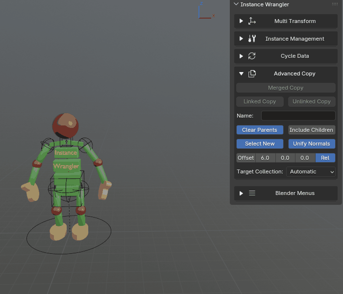
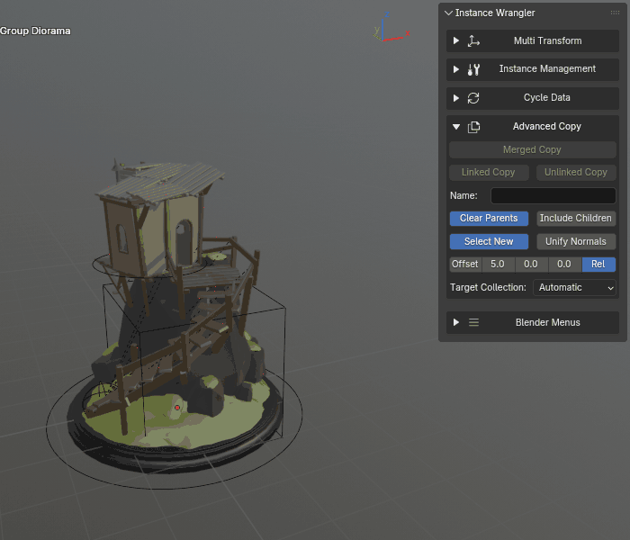
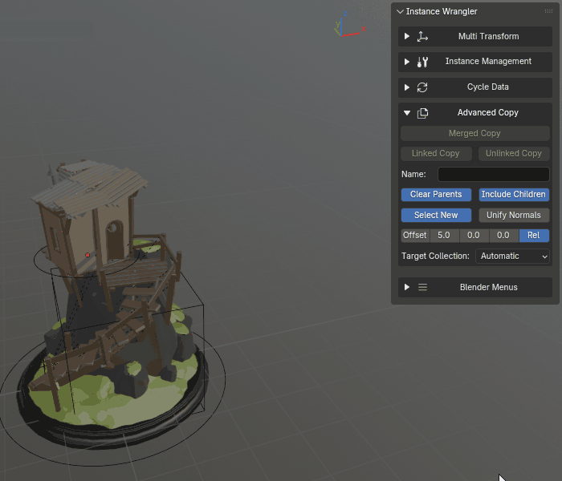
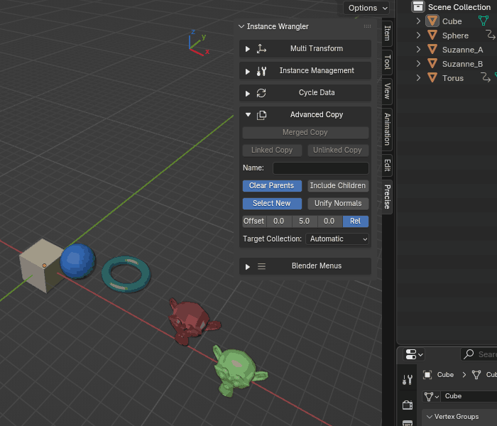
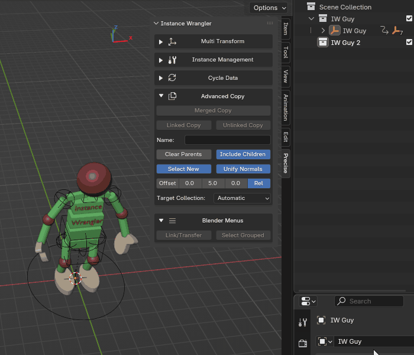

==============
Advanced Copy
==============

.. raw:: html

    <iframe width="700" height="395" src="https://www.youtube.com/embed/qatFMOQRPq0?si=e2IZhFL9TTKon3Xk" title="YouTube video player" frameborder="0" allow="accelerometer; autoplay; clipboard-write; encrypted-media; gyroscope; picture-in-picture; web-share" referrerpolicy="strict-origin-when-cross-origin" allowfullscreen></iframe>

The **Advanced Copy** toolkit provides four powerful operators for creating and merging objects:

* **Linked Copy** — creates new linked duplicates (instances) of your selection, with advanced options for placement and hierarchy.
* **Unlinked Copy** — creates new unlinked duplicates (copies) of your selection, with advanced options for placement and hierarchy.
* **Merged Copy** — creates a single, new game-ready mesh from a selection of multiple objects by joining and applying modifiers.
* **H Merge** — (Hierarchical Merge) batch operation that creates one merged mesh per top-level parent in the selection.

All four operators share a set of common options for controlling transformation, targeting, naming, hierarchy, and collection placement.

.. figure:: images/advancedCopy_Overview.gif
    :align: center

*Advanced copy will effortlessly copy or merge any type of object with ultimate control over the newly created object.*

Core Operators
==============

Linked Copy & Unlinked Copy
---------------------------

* **Linked Copy** creates new **linked duplicates** (:kbd:`Alt+D` instances) of your selection. It is a non-destructive way to create more instances while keeping them linked to the same underlying object data.
* **Unlinked Copy** creates new **unlinked duplicates** (:kbd:`Shift+D` copies) of your selection. These are simple duplicates which are no longer related to their originals.

Both operators support targeting, naming, and hierarchy options — see the **Advanced Copy Settings** section below.

Merged Copy
-----------

The **Merged Copy** operator creates a **single, clean, game-ready mesh** from a selection of multiple, potentially diverse objects (meshes, curves, surfaces, text objects and grease pencil objects). It automates the process of duplicating, converting, joining, and positioning objects. This is ideal for creating simplified proxy models, preparing assets for game engines, or combining parts for 3D printing.

**Key behaviors:**
* All modifiers on source objects are permanently applied (baked) during the merge process.
* Objects that cannot be converted to mesh — such as empties, lights, and cameras — are automatically excluded from the result.
* The origin of the new merged object is determined by the active object's world-space location. If no valid active object exists, the origin is set to the center of the new mesh's bounding box.

*The pivot is determined by the active object or the bounding box center.*

Hierarchical Merge (H Merge)
----------------------------

**H Merge** is a batch variant of **Merged Copy** designed to handle multiple hierarchies efficiently. When you select multiple hierarchy groups, it creates one merged mesh per top-level parent, using each root's name and world position to define the result.

**Use case:** You have ten separate rig groups in your scene, each with dozens of bones and armor pieces. Select all, click **H Merge**, and get ten optimized proxy meshes — one per rig — ready for export.

Smart Numbering
---------------
Every mode will attempt to increment new object names in an elegant way, following the pattern of the source object's name. 
* If the source object's name ends in a number (e.g. ``Name_LOD0``, ``object_001``), the copy is automatically named by incrementing that number — ``Name_LOD0`` becomes ``Name_LOD1``, ``object_001`` becomes ``object_002``. If no trailing number is found, Blender's default naming applies.
* For merged copies, the suffix _merged is added, if more merged copies are made following the same naming pattern, a numbered suffix is added (e.g. _merged.001, _merged.002, etc.)
* If set name is enabled, Smart Numbering will work as usual as long as the naming pattern ends in numbers.

Merge Options (Merged Copy & H Merge only)
------------------------------------------

These three controls appear on the same row and control how merged meshes handle their data:

**Clean Geometry** |icon_clean|
    When enabled, the operator welds overlapping vertices and removes loose geometry from the merged mesh. Useful for cleaning up complex source selections.

**Unify Normals** |icon_normals|
    When enabled, recalculates the normals of the final mesh to all point outwards. Useful for ensuring consistent shading before export (though Blender's recalculation is not always perfectly reliable — verify results).

**UV Merge Mode**
    Controls how UV channels from different objects are combined during merge:

    * **Merge by Name** (default) — keeps original channel names; channels with matching names are merged. Unmatched channels are kept separately (result may have more channels than any input).
    * **Merge by Match** — merges by name but discards any channel not present on *every* object before joining (guarantees no partial UV channels).
    * **Merge by Index** — renames all channels by position (UVMap, UVMap.001, etc.) before joining. Channels match by slot number regardless of original names.

Common Settings
===============

Advanced copy operators share a common set of options for controlling the behavior of the copy or merge process. These settings are designed to give you ultimate control over how new objects are created, named, transformed, and organized in your scene.

Apply Multi Transform
---------------------

When enabled, the Position, Rotation, and Scale values currently set in the **Multi Transform** panel are applied to the newly created objects immediately after they are created.

* **ON (Default):** Transforms from the Multi Transform panel are applied. Only transform types that are **included** (via the Pos / Rot / Scale toggles) are applied — disabled types are left as-is.
* **OFF:** The new objects are created at the exact location of the originals (or the merged pivot) without any additional transformation.

.. note::
   For **Merged Copy**, the transform is applied to the final merged object as a whole — after all source objects have been joined. This means the merged mesh moves as one unit from its pivot point, rather than each source piece being positioned individually before joining.

Include Children
----------------

When enabled, the operator will automatically expand your selection to include all (recursive) children of the objects you have selected before running.

* **For Merged Copy:** Requires a selected active object to determine which children to select.
* **For Linked Copy & Unlinked Copy:** Will find the children of all selected objects.

*Include children makes it very easy to duplicate hierarchies.*

Select New
----------

This toggle controls the final selection state after the operation is complete.

* **ON (Default):** The newly created object(s) will be selected.
* **OFF:** The original selection will be restored.

Skip Active
-----------

This option is useful when you want to use the active object as a reference point (pivot) for the operation, but do not want to duplicate the object itself.

* **ON:** The active object is used to calculate the center of the operation, but is excluded from the final copies.
    * **Parenting Behavior:** If **Skip Active** and **Include Children** are both enabled, the newly created copies will be automatically parented to the *original* active object.
* **OFF (Default):** The active object is treated as a normal part of the selection and is copied/merged along with everything else.

Clear Parents
-------------

This toggle controls how parent-child relationships are handled for the newly created objects. It behaves differently for each operator.

* **For Merged Copy**:
    * **ON (Default):** The final merged object will have no parent.
    * **OFF:** The operator will attempt to re-parent the final merged object to the parent of the original selection (e.g., the parent of the original active object, or a parent common to all selected objects).

* **For Linked Copy & Unlinked Copy**:
    * **ON (Default):** The new duplicates are unparented from each other, creating a 'flat' selection of new instances.
    * **OFF:** The original parent-child hierarchy is preserved in the duplicated set.

*Toggling clear parents will either flatten or maintain a hierarchical structure on new copies.*

Target Settings
===============

Target Settings allow you how the new copies or merged meshes are placed in the scene, whether they replace existing objects, which collection they go in to and how the objects are named. These settings work together to give you precise control over the final result of your copy or merge operation.

Target Mode
-----------

**Targeting** allows you to place or merge copies into an existing object or selection instead of creating entirely new objects at the source location.

The **Use Target** toggle (checkbox) enables or disables targeting. When disabled, all copy operations work directly on the selection without any target object.

When targeting is enabled, three target mode icons appear:

* **Eyedropper** — **Manual (Set Target)** mode
* **Magnifying Glass** — **Auto** mode
* **Select Icon** — **Selection** mode

Manual Target (Set Target)
^^^^^^^^^^^^^^^^^^^^^^^^^^

Before running a copy operation, click the **Set Target** button (or eyedropper icon) to store the currently active object as the target. Once set, the button shows **T: {object name}** and an **X** button to clear the target.

**For Linked Copy and Unlinked Copy:**

The stored target object is **removed** from the scene. A new duplicate of the source is created and placed at the target's world position, inheriting its parent relationship. Only the single stored target is affected — no other objects in the scene are changed.

**For Merged Copy:**

The merged mesh **data-block** is swapped into the target object. The target itself is not moved or removed — only its mesh data is replaced. All other objects in the scene sharing that same data-block are automatically updated to use the new mesh, in-place without moving or renaming.

**For H Merge:**

Not supported. The operator cancels with a warning when a manual target is set.

**Use cases:**

* Replace a specific object in-place with a copy of the source (Linked/Unlinked Copy).
* Update a game-ready proxy mesh in-place: adjust your source objects, re-merge into the existing target, and all instances instantly reflect the new geometry (Merged Copy).

.. note::
   The redo/F9 panel is not compatible when a manual target is set. Settings are read from the last values set in the sidebar or popup. **Clear Parents** and **Target Collection** have no effect in this mode. The **Name** field controls the name of the replaced data-block (wildcard ``*`` is supported).

Auto Target (Search)
^^^^^^^^^^^^^^^^^^^^

In **Auto** mode, the operator searches for a target object by name or pattern. The **Search** field lets you specify what to look for.

**Per-Operator Behavior:**

Linked Copy
   Replaces each found object with a linked copy of the source at its position. With an empty search, all other objects in the scene sharing the source's data-block are targeted.

Unlinked Copy
   Replaces the found object with an unlinked copy of the source at its position. With an empty search, the source object's own name is used as the search term.

Merged Copy
   With an empty search, uses the resolved output name (e.g. ``SourceName_Merged``) as the search term. For mesh targets: swaps the merged data-block into all objects sharing the old one (all updated in-place). For non-mesh targets: the target object is replaced with a new mesh object.

H Merge
   Per hierarchy group, each group independently searches for a target by the root's name and swaps the merged data-block into all matching instances.

**Search Syntax:**

* **Exact Name:** Enter the exact name of an object (case-insensitive partial match).
* **Wildcard** ``*`` **:** Use ``*`` as a placeholder for the source object's name. For example, ``*_LOD0`` finds the LOD0 version of each object (e.g., ``Cube_LOD0`` when source is ``Cube``).
* **Wildcard** ``%`` **:** Use ``%`` as a placeholder for any sequence of characters. For example, ``Prop_%`` finds ``Prop_Cube``, ``Prop_001``, ``Prop_Rock``, etc.

**Multi-Group Handling:** When you have multiple hierarchy groups selected, each group targets independently — each root searches for its own target based on its name. This enables merging or replacing multiple hierarchies in one operation:

* **Linked Copy** and **Unlinked Copy** apply auto-target per group — each root searches independently for its own target (e.g., ``Cube`` finds ``Cube_Target``, ``Sphere`` finds ``Sphere_Target``).
* **H Merge** also applies per group — each hierarchy group's merged result targets independently.

**Use cases:**

* An incredibly powerful workflow is to update the hierarchies of other linked instances. For example, you have a spaceship asset which is instanced multiple times in your scene. You added some objects to the original linked as child objects, but they don't appear in the other instances. Use Auto Target mode (but keep it empty to affect all other instances) with Linked Copy to search for all other instances and replace them with new linked copies of the updated source — now all your instances have the new children objects.
* Another powerful workflow is to merge a hierarchy or selection of meshes into other existing objects in the scene. If you search for a common pattern in the target objects' names, you can target multiple objects in the scene to receive a merged copy of the source hierarchy in one click.
* Building on that, you can use H Merge with auto-targeting to merge multiple hierarchies at once, each targeting a different object in the scene based on their name. For example, you have 10 assembled spaceships in your scene, each with a different name. You want to create a merged mesh for each assembly, and you want each merged copy to replace an existing placeholder mesh in the scene. Select all 10 spaceship assemblies, choose H Merge with auto-targeting, enter a search pattern that matches the placeholder meshes (e.g. ``*_LOD0``, the asterisk will insert the original name, letting the tool search for the corresponding placeholder, for example ``Spaceship1_LOD0``), and instantly get 10 merged meshes placed perfectly at the location of each placeholder — all in one operation.

Selection Target
^^^^^^^^^^^^^^^^

In **Selection** target mode, the active object's hierarchy is treated as the **source**; all other selected hierarchies are treated as **targets**. Select multiple separate hierarchies, keep one as the active object, and run the copy operation — the result replaces each target hierarchy in-place at its position.

**Per-Operator Behavior:**

* **Linked Copy:** Creates a new linked copy of the source. Each target hierarchy is removed and replaced with that copy at the target's position, rotation, and scale.
* **Unlinked Copy:** Creates a new unlinked copy of the source. Each target hierarchy is removed and replaced with that copy.
* **Merged Copy:** **Not available** in this mode. Use **H Merge** instead.
* **H Merge:** The source hierarchy is preserved (not merged). A merged copy of the source is created and placed at each target's world position; the source hierarchy remains in place.

**Use cases:**

* *Linked Copy:* You assembled a modular shelf unit from several objects — frame, shelves, books, decorations — organized as a hierarchy. The same shelf needs to appear in multiple spots in your scene, currently occupied by simple placeholder hierarchies. Select all the placeholder hierarchies, make your shelf assembly the active object, and run **Linked Copy** with Selection Target. Each placeholder is removed and replaced with a new linked instance of the shelf hierarchy at its exact position, all sharing the same underlying data.

* *H Merge:* You have a detailed vehicle assembly with dozens of parts spread across a hierarchy. Scattered around your scene are simple marker hierarchies, each indicating where a merged proxy mesh should be placed. Select all the marker hierarchies, make the vehicle assembly the active object, and run **H Merge** with Selection Target. The vehicle is merged into a single mesh, and that result is placed at each marker's position — the original assembly remains untouched.

Naming
------

The **Name** field controls how the newly created object(s) are named.

**Set Name Toggle**

When the **Set Name** checkbox is enabled, the text in the **Name** field is used. When disabled, the default naming behavior applies (see below).

**Name Patterns**

**For Merged Copy & H Merge:**

* **Empty field (default):** The new object is named ``MergedCopy`` or ``MergedCopy.001``, etc.
* **Using wildcard** ``*``: Use as a placeholder for the active object's name. Example: ``Prop_*_LOD0`` on ``Cube`` produces ``Prop_Cube_LOD0``.
* **Any other text:** Used as the exact name for the new object.
* **In Target Merge Mode (Manual):** The name field applies to the replaced data-block. If empty, the data-block keeps its original name.

**For Linked Copy & Unlinked Copy:**

* **Empty (default):** Uses **Smart Numbering** (see below).
* **Using wildcard** ``*``: Use as a placeholder for each object's original name. Example: ``Prop_*_LOD0`` on ``Cube`` produces ``Prop_Cube_LOD0``.
* **Any other text:** Used as the base name for all new objects.

*Different ways of setting the name of the newly copied objects.*

Target Collection
-----------------

This dropdown menu controls which collection the newly created object(s) will be placed in.

* **Automatic (Default):** The operator intelligently determines the most logical collection based on your original selection:
    * For **Merged Copy** and **H Merge**, the new mesh is placed in the collection of the original active object (or the Scene Collection if no active object exists).
    * For **Linked Copy** and **Unlinked Copy**, each new duplicate is placed in the **same collection(s) as its original counterpart**, preserving your scene's organization.

* **Explicit Choice:** Select any collection in the scene to force all new objects into that specific collection.

*You can target collections for the new copies or handle it automatically in a reliable way.*
