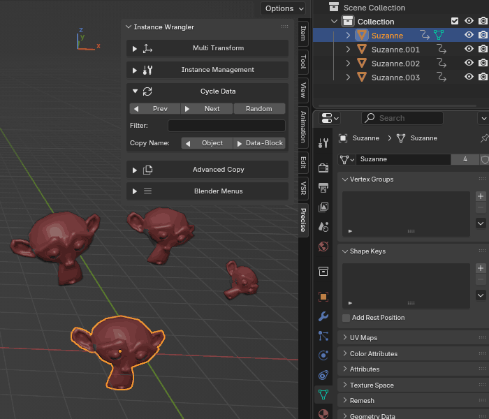

Copy Name (Object ↔ Data)
===========================

These two buttons are powerful utilities for managing the names of your objects and their associated **Object Data**. In scenes with many linked duplicates, keeping names consistent is crucial for organization. These tools allow you to quickly enforce a clear naming convention across entire instance groups.

.. raw:: html

   <iframe width="700" height="315" src="https://www.youtube.com/embed/5G4moaQi-X0?si=UKAu8jSyMsYRzxDy" title="YouTube video player" frameborder="0" allow="accelerometer; autoplay; clipboard-write; encrypted-media; gyroscope; picture-in-picture; web-share" referrerpolicy="strict-origin-when-cross-origin" allowfullscreen></iframe>

* **← Object:** This copies the name of the object's data-block to the object itself. This is used to propagate or "sync" that master name across multiple selected instances.
* **→ Data-Block:** This copies the name of the selected object to its underlying data-block. This is useful for establishing the "master" name for an entire set of instances.

*Using Copy Name to sync names of objects and data blocks across multiple instances.*

Workflow: Consistent Naming for Instances
-------------------------------------------

This workflow is perfect for cleaning up a scene where you've placed many instances without worrying about their names.

Let's say you have dozens of linked rocks named ``Sphere.001``, ``Sphere.034``, etc., and you want to rename them all consistently.

#. **Step 1: Set the Source Name**
   Find one representative instance and give it a clear, descriptive name in the Outliner, for example, **``Rock_Large_01``**.

#. **Step 2: Copy Name to Data-Block**
   With only that one renamed object selected, click the **→ Data-Block** button. The shared data-block for all the rock instances is now also named **``Rock_Large_01``**.

#. **Step 3: Select All Instances**
   Now, select all the rock instances that need renaming. You can do this quickly by selecting your source rock and using the **Select Linked** tool.

#. **Step 4: Sync Name to Objects**
   With all the instances selected, click the **← Object** button. Every selected object's name will instantly be updated to match the data-block's name.

In just a few clicks, you have synced the names of all your instances, creating a much cleaner and more organized scene.

*Demonstrating a scenario similar to what is described in the workflow example above.*
