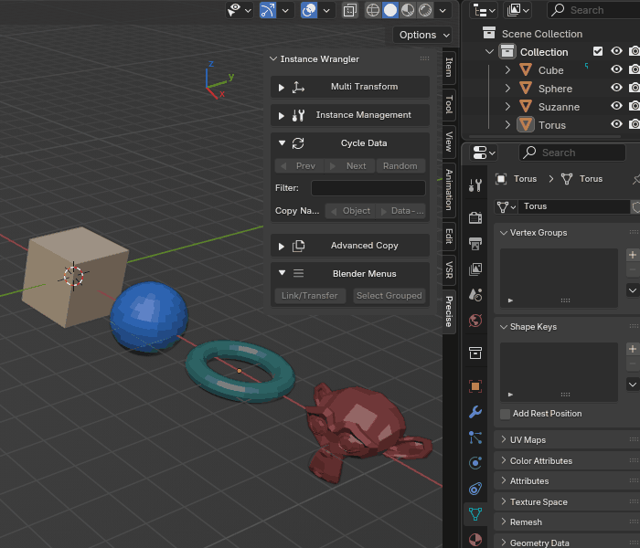
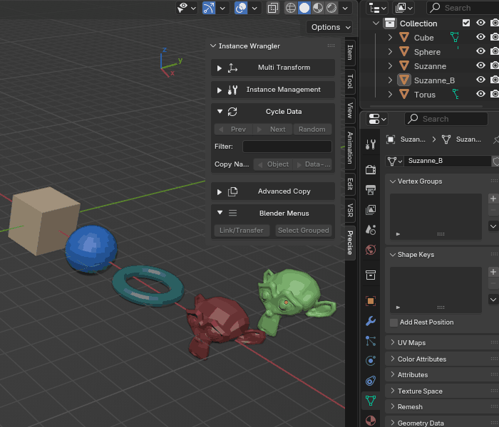

.. _cycledata:

==========
Cycle Data
==========

The **Cycle Data** tool is a powerful feature for rapid iteration and asset swapping. It allows you to replace an object's underlying **Object Data** (like its mesh or curve geometry) with another data-block of the same type available in your Blender file.

Think of it as quickly trying on different versions of an asset without ever moving the object itself. The object's location, rotation, scale, and even its modifiers are all preserved; only its core data is swapped.

How It Works
------------

When you click **Next**, **Prev**, or **Random**, the operator performs the following steps for each selected object:

#. It identifies the object's type (e.g., ``Mesh``, ``Curve``, ``Text``).
#. It finds all other data-blocks of that same type currently in your ``.blend`` file.
#. For curve-based types, it intelligently pre-filters the list to only include compatible data (e.g., a Text object will only cycle with other data-blocks that are also text).
#. It sorts the valid data-blocks **alphabetically** by name.
#. The list is then narrowed down further based on the text in the **Filter** field.
#. Finally, it replaces the object's current data with the next, previous, or a random choice from this final list.

The Next/Prev cycle will automatically wrap around. For example, clicking **Next** when on the last data-block in the list will cycle back to the first one.

*Cycling through object data on one or more objects.*

How to Use
----------

The workflow is designed for experimentation:

#. Select one or more objects you wish to change.
#. Use the **Filter** field to narrow your choices (optional).
#. Click the **Next**, **Prev**, or **Random** buttons to change the data.

You can select multiple objects at once, even of different types. Each object will cycle independently within its own category.

Advanced Controls: Filtering and Randomizing
--------------------------------------------

**Filter Textbox**
    You can type a partial name into this field to narrow down the list of data-blocks that the operator will cycle through. The filter is not case-sensitive and will find any data-block whose name *contains* your text. A field containing only spaces is treated as empty.
    
    *Example: If you have data-blocks named ``Rock_Small``, ``Rock_Large``, and ``Pebble``, typing ``rock`` into the filter will limit the cycle to only the first two.*

*Using a filter to limit the range of cycled objects.*

**Random Button**
    This button assigns a random data-block from the available candidates (respecting the current filter) to each selected object. It is designed to not pick the same data-block an object is already using, ensuring a change happens with each click (if other options are available). This is excellent for creating natural-looking variation across a large number of selected instances.

Example Workflows
-----------------

**Auditioning Assets**
    This tool is invaluable for tasks like set dressing. If you have a ``Tree_Placeholder`` object, you can select it and click **Next** repeatedly to cycle through all available tree models (``Tree_Oak``, ``Tree_Pine``, etc.) to see which one fits best in your scene.

.. figure:: images/cycledata_staging.gif
   :align: center

*Auditioning trees and rocks and using the randomize and filter functionality.*

**Swapping Levels of Detail (LODs)**
    This tool is also ideal for managing **LODs**. If your assets are named alphabetically (e.g., ``MyAsset_LOD0``, ``MyAsset_LOD1``), you can select all ``_LOD0`` instances and click **Next** to switch them all to ``_LOD1`` instantly. You can also use the **Filter** field: typing ``LOD2`` and clicking **Next** will jump all selected objects directly to their ``_LOD2`` version.
