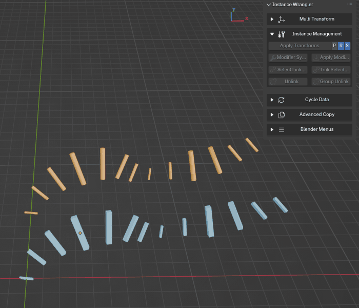

.. _groupunlink:

Group Unlink
============

The **Group Unlink** tool creates a new, independent instance group from your current selection. It "splits off" the selected objects from their unselected peers, while keeping the selected objects linked to each other.

This provides a crucial workflow that is distinct from the standard **Unlink** operator, which makes *every* object unique. **Group Unlink** makes the *selection* unique as a new group.

.. raw:: html

   <iframe width="560" height="315" src="https://www.youtube.com/embed/VTQgnAn1lXM?si=IuzQnHMjR_lGYoJ_" title="YouTube video player" frameborder="0" allow="accelerometer; autoplay; clipboard-write; encrypted-media; gyroscope; picture-in-picture; web-share" referrerpolicy="strict-origin-when-cross-origin" allowfullscreen></iframe>

How to Use
----------

#. Select two or more linked duplicates that you wish to separate into a new, independent group.
#. Click the **Group Unlink** button.

*Unlinking multiple instances from the rest of their instance groups while still keeping links between each other.*

The Result
----------

The operator creates a single new copy of the **Object Data** and assigns it to all of your selected objects.

Your selection is now an independent instance group. Modifying the geometry of one of the selected objects will affect the others in the selection, but it will no longer affect the original, unselected instances they were previously linked to.

Practical Example
-----------------

This tool can process multiple instance groups at once. Imagine your scene contains:
* Four linked boxes: ``Box_A``, ``Box_B``, ``Box_C``, ``Box_D`` (all sharing ``BoxData``).
* Four linked spheres: ``Sphere_A``, ``Sphere_B``, ``Sphere_C``, ``Sphere_D`` (all sharing ``SphereData``).

If you select ``Box_C``, ``Box_D``, ``Sphere_B``, and ``Sphere_C`` and then click **Group Unlink**, the result is:

* **Boxes:** ``Box_A`` and ``Box_B`` remain linked to the original ``BoxData``. ``Box_C`` and ``Box_D`` are now linked to a new, unique data-block (e.g., ``BoxData.001``).
* **Spheres:** ``Sphere_A`` and ``Sphere_D`` remain linked to the original ``SphereData``. ``Sphere_B`` and ``Sphere_C`` are now linked to a new, unique data-block (e.g., ``SphereData.001``).

This is the ideal tool for creating variations of a placed asset without needing to manually duplicate, unlink every object, and then re-link them into a new group.
