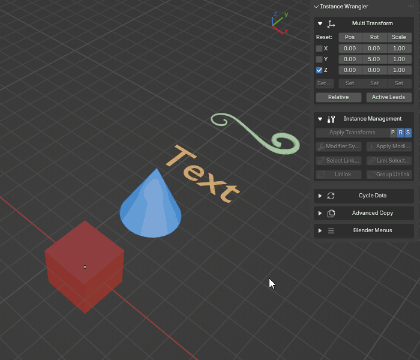

Link Selected
=============

The **Link Selected** tool makes all selected objects become linked duplicates (instances) of the **active object**. It does this by assigning the active object's **Object Data** to every other object in the selection.

.. raw:: html

   <iframe width="560" height="315" src="https://www.youtube.com/embed/5ZuPOpuNuFY?si=v6x16oJDhmOSj1nz" title="YouTube video player" frameborder="0" allow="accelerometer; autoplay; clipboard-write; encrypted-media; gyroscope; picture-in-picture; web-share" referrerpolicy="strict-origin-when-cross-origin" allowfullscreen></iframe>

A More Powerful Link
--------------------

This tool is very similar to Blender's native :kbd:`Ctrl+L` > ``Link Object Data`` function, but with a crucial advantage: **it can automatically convert the type of the selected objects to match the source.**

In Blender, you cannot directly link a Curve's data to a Mesh object. You would have to manually delete the Curve, create a new Mesh, copy all the transforms, and then link the data. Instance Wrangler automates this entire process in a single click.

*Linking object data from one object to one or more others, even between different object types.*

How It Works
------------

The operator's behavior depends on the types of objects you have selected:

* **If the objects are the same type** (e.g., you link several Meshes to an active Mesh), it behaves exactly like Blender's native tool, simply swapping their Object Data.

* **If the objects are different types** (e.g., you link a Curve and a Text object to an active Mesh), the operator intelligently performs a conversion. It will safely replace the Curve and Text objects with new Mesh objects, perfectly preserving the original name, location, rotation, scale, and parenting of each, before linking the data.

This allows you to, for example, replace a blockout model made of curves with instances of a final mesh asset, without losing any of your scene layout work.

How to Use
----------

The process relies on a source (the active object) and one or more targets (the other selected objects).

#. Select the object(s) you want to change (the targets).
#. While holding :kbd:`Shift`, click the object you want them to become instances of. This makes it the **active object** (it will have a brighter outline).
#. Run the **Link Selected** operator.

.. note::
   This operation requires that the active object has a linkable data-block (e.g., a Mesh, Curve, or Armature). It will not work if the active object is an Empty. The tool will warn you if it is unable to perform a requested conversion between incompatible types.
