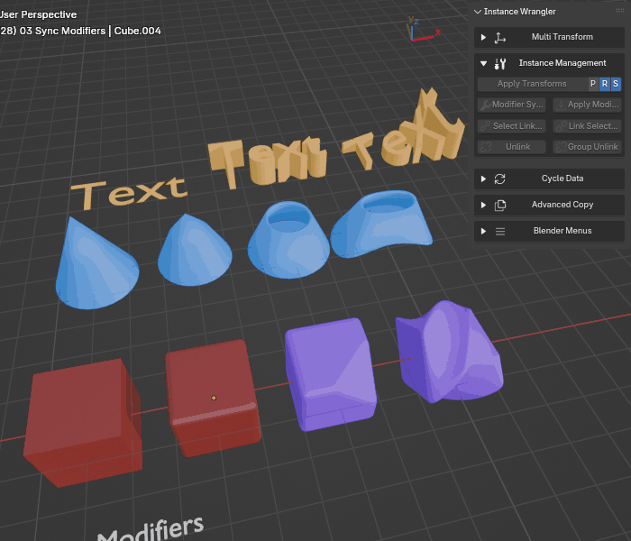
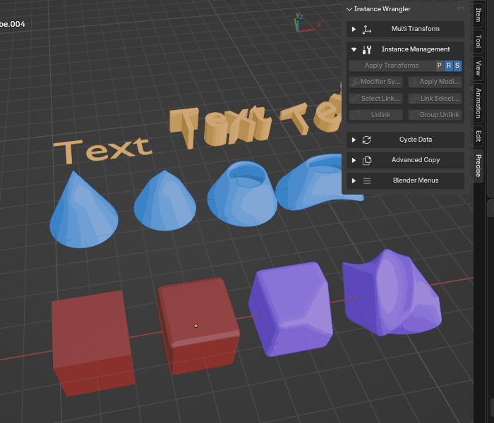

.. _modifier_sync:

===============
Modifier Sync
===============

The **Modifier Sync** tool copies the complete modifier stack from a source object to all of its linked duplicates (instances). This ensures all instances of an object share the exact same modifiers.

It works with any object type that can have modifiers, including Meshes, Curves, and Text.

.. raw:: html

    <iframe width="700" height="395" src="https://www.youtube.com/embed/jmYC9DbxdKY?si=hHmqbwuugWyZ6ncr" title="YouTube video player" frameborder="0" allow="accelerometer; autoplay; clipboard-write; encrypted-media; gyroscope; picture-in-picture; web-share" referrerpolicy="strict-origin-when-cross-origin" allowfullscreen></iframe>

How It Works: Global vs. Limited Sync
=====================================

The operator has two distinct modes of operation depending on your selection.

Global Sync (Default Behavior)
------------------------------

In most cases, the operator performs a **global sync**. It identifies a "leader" object for an instance group and copies its modifier stack to **every other instance** of that object in the entire scene, whether it's selected or not. This can be performed on multiple different instance groups in a single operation.

*Global sync on groups of different types of instanced objects.*

Limited Sync (Special Case)
---------------------------

A special, limited sync mode is triggered if your selection meets these specific criteria:

* The selection contains **multiple objects**.
* All selected objects belong to the **same single instance group**.
* One of the selected objects is the **active object**.

When this condition is met, the sync is **limited to your selection**. The active object's modifiers will only be copied to the *other selected objects*, leaving any unselected instances of that group untouched. This is useful for creating a unique variation from a subset of instances.

*Limited sync on different groups of instances.*

Selection Rules (Determining the Leader)
========================================

The operator must first find a "leader" (the source object) for each instance group represented in your selection. The rules are as follows:

* **If your entire selection belongs to one group:** The **active object** must be part of the selection and is always considered the leader.

* **If you select objects from multiple groups:** The operator can process all of them at once. To avoid ambiguity, a leader must be clear for each group:
    * If you select only **one object** from a group, it automatically becomes that group's leader.
    * If you select **multiple objects** from a group, the **active object** must be one of them to be designated as that group's leader.
