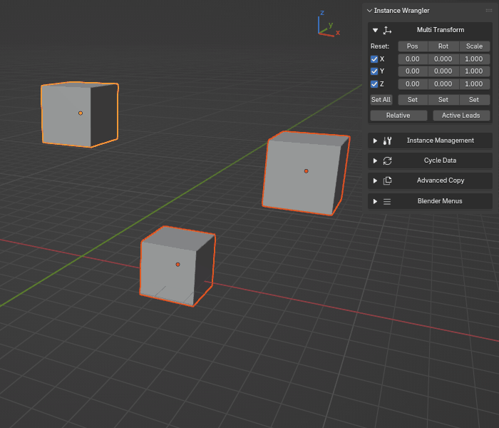
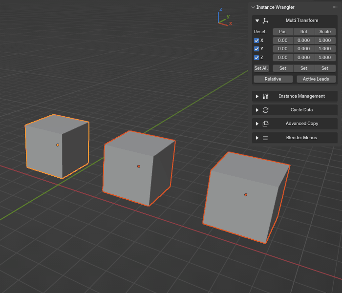
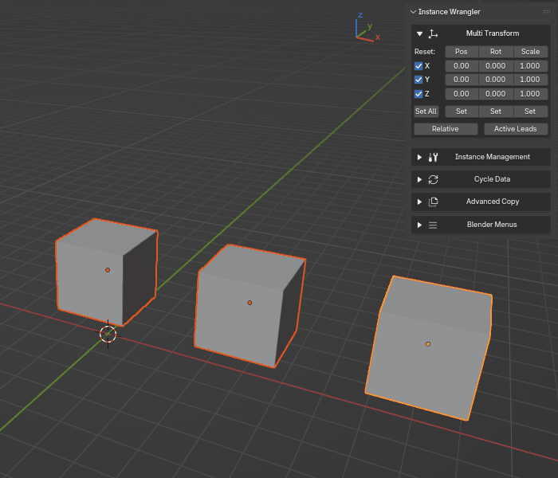
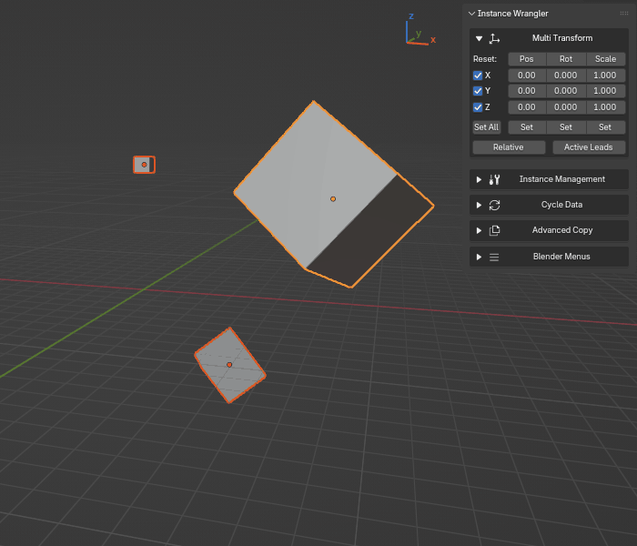

Multi Transform
===============

The **Multi Transform** panel provides a powerful and precise way to manipulate the position, rotation, and scale of multiple objects simultaneously. It's designed for workflows that demand accurate, numeric input, offering a level of control that goes beyond Blender's standard interactive tools.

The panel is organized into a grid layout, with each row corresponding to a transform **axis** (X, Y, and Z). This allows you to view and edit the Position, Rotation, and Scale values for a specific axis all in one place. This structure is controlled by a powerful set of modes, allowing for both standard independent editing and an **Active Leads Mode** which uses the active object as a group pivot.

.. raw:: html

   <iframe width="700" height="394" src="https://www.youtube.com/embed/SNSlH7yfvhM?si=GbxKZPJMPVxr24y5" title="YouTube video player" frameborder="0" allow="accelerometer; autoplay; clipboard-write; encrypted-media; gyroscope; picture-in-picture; web-share" referrerpolicy="strict-origin-when-cross-origin" allowfullscreen></iframe>

UI Controls Explained
---------------------

* **Header Row:** The top row contains shortcuts to reset the transform values. **Pos** resets Position to ``(0,0,0)``, **Rot** resets Rotation to ``(0,0,0)``, and **Scale** resets Scale to ``(1,1,1)``.
* **Axis Rows (X, Y, Z):** Each of these three rows contains:
    * An **axis toggle** on the left to include or exclude that axis from the operation.
    * Three numeric input fields for that axis's **Position**, **Rotation**, and **Scale**.
* **Set Buttons Row:** The bottom row contains the buttons to apply the transforms:
    * **Set All:** Applies the values for Position, Rotation, and Scale all at once.
    * **Set (per-transform):** Applies only the values for either Position, Rotation, or Scale.
* **Mode Toggles:**
    * **Relative Toggle:** Switches between **Absolute** and **Relative** modes. Its behavior changes depending on whether **Active Leads** is enabled.
    * **Active Leads Toggle:** Switches the tool to a powerful mode where the **active object** acts as a pivot or "fake parent" for the rest of the selection.

Standard Modes (Active Leads OFF)
---------------------------------

When **Active Leads** is disabled, the tool operates on each selected object independently.

* **Absolute Mode** (``Relative`` disabled): This mode sets the transform values to the **exact numbers** you enter. It's perfect for aligning objects to a specific coordinate.
    * *Example: To align all selected objects to a height of 5 meters, you would disable ``Relative``, enter ``5.0`` in the Z position field, and click **Set**.*

* **Relative Mode** (``Relative`` enabled): This mode **adds** (or multiplies for scale) the entered values to each object's current transform. It's ideal for nudging a selection of objects while preserving their existing arrangement.
    * *Example: To move all selected objects 2 units to the right, you would enable ``Relative``, enter ``2.0`` in the X position field, and click **Set**.*

Setting the position in absolute and relative mode and using the axis rows.

Setting the rotation in absolute and relative mode and using the axis rows.

Setting the scale in absolute and relative mode and using the axis rows.

Using "Set All" to set position, rotation and scale at the same time.

Active Leads Mode (Active Leads ON)
-----------------------------------

Enabling **Active Leads** makes the **active object** the pivot point for the entire selection, like a lead dancer guiding their partners. The ``Relative`` toggle now switches between two powerful sub-modes.

Absolute Mode (Relative OFF): Transform as Children
^^^^^^^^^^^^^^^^^^^^^^^^^^^^^^^^^^^^^^^^^^^^^^^^^^^^^

In this mode, the entire selection behaves as if temporarily parented to the active object. You are setting an **absolute target** for the leader, and the followers will arrange themselves around it.

* **Position:** The entire group moves rigidly to place the active object at the target coordinates.
* **Rotation:** Followers **orbit** around the active object as it rotates to its new orientation.
* **Scale:** Followers move closer to or further away from the active object as it scales to its new size, maintaining the group's proportions.

Relative Mode (Relative ON): Incremental Parented Transform
^^^^^^^^^^^^^^^^^^^^^^^^^^^^^^^^^^^^^^^^^^^^^^^^^^^^^^^^^^^^^

In this mode, the UI values represent an **incremental change** that is applied to the active object, and the followers move with it in a parented fashion with each click.

* **Position:** The entire group moves by the specified amount.
* **Rotation:** The active object rotates on its axis by the specified degrees, and all followers **orbit** it by that same amount.
* **Scale:** The active object is scaled by the specified factor, and all followers scale with it, moving further from or closer to the leader proportionally.
