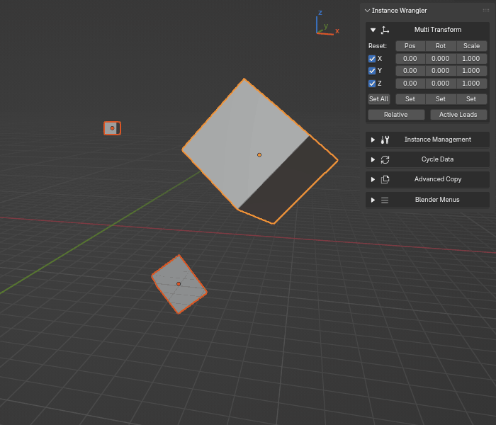
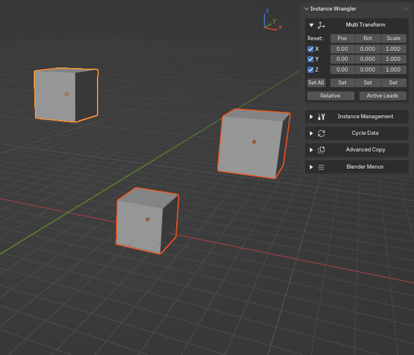
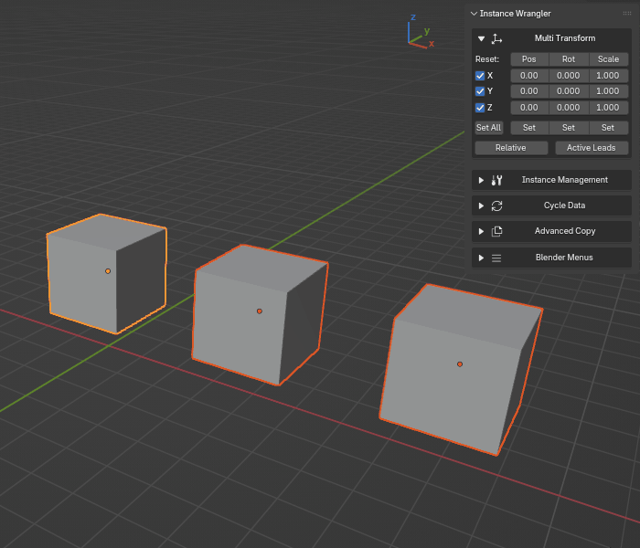
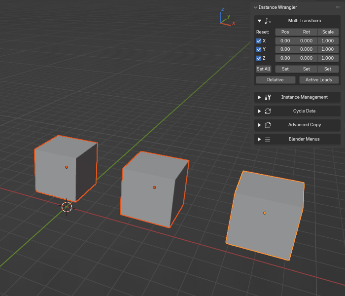
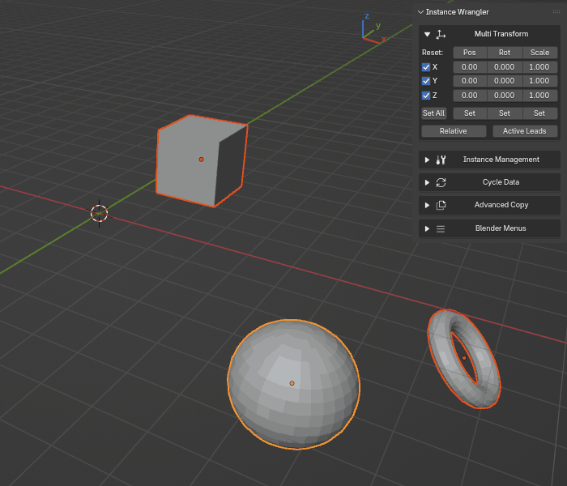
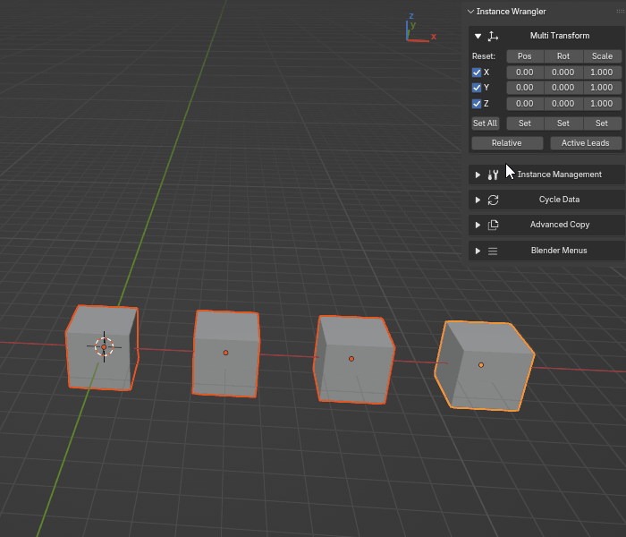
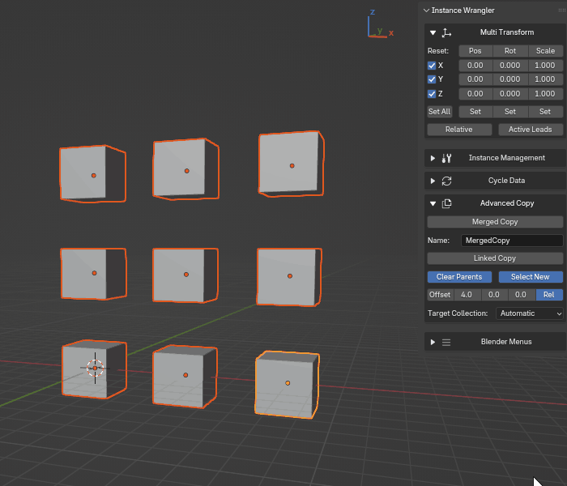

Multi Transform
===============

The **Multi Transform** panel provides a powerful and precise way to manipulate the position, rotation, and scale of multiple objects simultaneously. It's designed for workflows that demand accurate, numeric input, offering a level of control that goes beyond Blender's standard interactive tools.

The panel is organized into a grid layout, with each row corresponding to a transform **axis** (X, Y, and Z). This allows you to view and edit the Position, Rotation, and Scale values for a specific axis all in one place. This structure is controlled by a powerful set of modes, allowing for both standard independent editing and an **Active Leads Mode** which uses the active object as a group pivot.

.. raw:: html

   <iframe width="700" height="395" src="https://www.youtube.com/embed/TcjOvJjajvQ?si=HoJK9LkZfPZ27_8A" title="YouTube video player" frameborder="0" allow="accelerometer; autoplay; clipboard-write; encrypted-media; gyroscope; picture-in-picture; web-share" referrerpolicy="strict-origin-when-cross-origin" allowfullscreen></iframe>

UI Controls Explained
-----------------------

The panel is organized as a grid. On the left is a column of **axis toggles**. To the right are three value columns — one each for **Position**, **Rotation**, and **Scale**.

* **Include Toggles (Pos / Rot / Scale):** The top cell of each value column is a toggle that controls whether that transform type is included in **Set All** operations. For example, disabling **Rot** means clicking **Set All** will only apply Position and Scale, leaving each object's rotation untouched. These toggles also affect the **Apply Multi Transform** option in :doc:`advancedcopy`.
* **Axis Toggles (X / Y / Z):** Each row on the left side filters which axes are affected. Disabling **Z** means the Z-axis value will never be written, regardless of which Set button you click.
* **Value Fields:** The nine input fields in the grid hold the target values for each axis and transform type.
* **Set Buttons:** The row below the grid contains the action buttons:
    * **Set All:** Applies all included transform types to the selection at once.
    * **Set P / Set R / Set S:** Applies only Position, Rotation, or Scale respectively, ignoring the Pos/Rot/Scale include toggles.
* **Mode Toggles:**
    * **Relative:** Switches between Absolute and Relative modes. See `Relative Toggle`_ below.
    * **Active Leads:** Switches to a mode where the active object acts as a pivot for the selection. See `Active Leads Mode`_ below.

Using "Set All" to apply position, rotation and scale at the same time.

Modifier Keys
--------------

All four Set buttons (**Set All**, **Set P**, **Set R**, **Set S**) support modifier keys to perform related actions without changing any settings:

.. list-table::
   :header-rows: 1
   :widths: 15 85

   * - Key
     - Action
   * - :kbd:`LMB`
     - **Set** — applies the current values to the selection.
   * - :kbd:`Ctrl`
     - **Get** — reads the active object's current transform into the value fields (respects axis toggles).
   * - :kbd:`Shift`
     - **Round** — snaps the value fields to the nearest clean step: 0.5 m for Position, 1° for Rotation, 0.1 for Scale (respects axis toggles).
   * - :kbd:`Alt`
     - **Reset** — resets the value fields to their defaults: Position → 0, Rotation → 0°, Scale → 1 (respects axis toggles).

For **Set All**, :kbd:`Ctrl`, :kbd:`Shift`, and :kbd:`Alt` also respect the **Pos / Rot / Scale include toggles** — only the enabled transform types are affected.

Relative Toggle
------------------
The **Relative** toggle lets you switch between relative and absolute transform mode.

* **Absolute Mode** (``Relative`` disabled): This mode sets the transform values to the **exact numbers** you enter. It's perfect for aligning objects to a specific coordinate.
    * Example: To align all selected objects to a height of 5 meters, you would disable ``Relative``, enter ``5.0`` in the Z position field, and click **Set**.

* **Relative Mode** (``Relative`` enabled): This mode **adds** (or multiplies for scale) the entered values to each object's current transform. It's ideal for nudging a selection of objects while preserving their existing arrangement.
    * Example: To move all selected objects 2 units to the right, you would enable ``Relative``, enter ``2.0`` in the X position field, and click **Set**.

Setting the position in absolute and relative mode and using the axis rows.

Setting the rotation in absolute and relative mode and using the axis rows.

Setting the scale in absolute and relative mode and using the axis rows.

Active Leads Mode
----------------------

Enabling **Active Leads** makes the **active object** the pivot point for the entire selection, like a lead dancer guiding their partners.
 
* **Position:** The entire group moves rigidly to place the active object at the target coordinates.
* **Rotation:** Followers **orbit** around the active object as it rotates to its new orientation.
* **Scale:** The active object is scaled by the specified factor, and all followers scale with it, moving further from or closer to the leader proportionally.

**Relative Toggle:** offers a lot of flexibility in Active Leads mode.

* **Relative Mode Off (Absolute Mode):** You are setting an **absolute target** for the leader, and the followers will arrange themselves around it.
* **Relative Mode On:** In this mode, the UI values represent an **incremental change** that is applied to the active object, and the followers move with it in a parented fashion with each click.	

Use Active Leads to move objects as a group, using the active object as the group pivot.

Use Active Leads to rotate objects as a group, using the active object as the group pivot.

Use Active Leads to scale objects as a group, using the active object as the group pivot.
