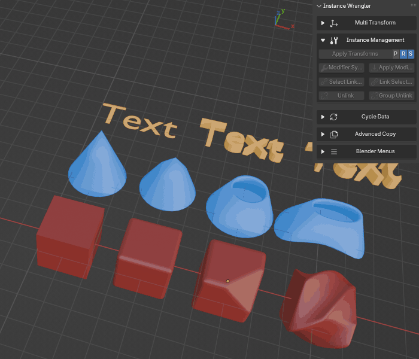

Select Linked
=============

The **Select Linked** tool is a utility designed to quickly expand your selection to include all linked duplicates of the object(s) you currently have selected.

Its purpose is to gather all instances of an asset at once, no matter where they are in your scene.

.. raw:: html

   <iframe width="560" height="395" src="https://www.youtube.com/embed/pIwjoE2UUI8?si=OVAQZsLtEotpr3kr" title="YouTube video player" frameborder="0" allow="accelerometer; autoplay; clipboard-write; encrypted-media; gyroscope; picture-in-picture; web-share" referrerpolicy="strict-origin-when-cross-origin" allowfullscreen></iframe>

How to Use
----------

The operator is straightforward:

#. Select one or more objects in the viewport.
#. Click the **Select Linked** button.
#. The tool will inspect the **Object Data** of each object in your selection and then find and select every other **visible** object in the scene that shares that same data.

This is an **additive** process; the newly found objects will be added to your current selection without deselecting what you already have.

*Selecting one or multiple instance groups using Select Linked*

Key Behavior
------------

* **Works with Multiple Groups:** You can select several different objects (e.g., a cube and a curve) and run the operator once. It will find all instances of the cube *and* all instances of the curve simultaneously.

* **Respects Visibility:** The tool will not select objects that are hidden or located in a disabled collection. This ensures you are only selecting items relevant to your current view.

This feature is extremely useful for quickly gathering all instances of a particular asset before performing a batch operation, such as assigning a material or using another Instance Wrangler tool like **Multi Transform**.
