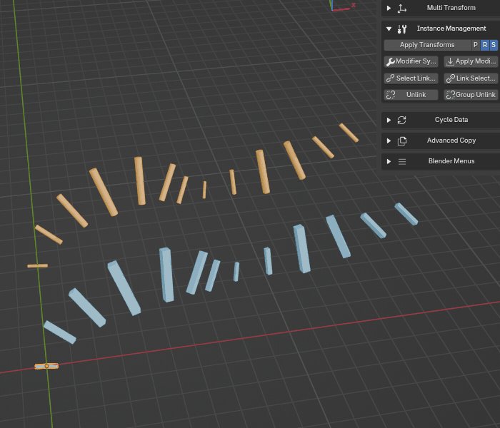

.. _unlink:

Unlink
======

The **Unlink** tool is the direct opposite of linking. It takes a selection of linked duplicates and makes each one independent by giving it a unique copy of its **Object Data**.

After running this operation, modifying the geometry of one object will no longer affect the others.

How to Use
----------

The process is very simple:

#. Select one or more objects that you want to unlink.
#. Click the **Unlink** button.

Each selected object will now be a "single user," meaning it no longer shares its data with any other objects in your selection.

*Unlinking one or multiple objects from the rest of their instance groups*

Key Feature: Intelligent Reporting
----------------------------------

While this function is similar to Blender's built-in tools (Make Single User), Instance Wrangler's version provides a more intelligent and helpful report. After the operation, it will tell you exactly how many objects were actually unlinked. If your selection contained objects that were already unique, the tool will inform you that no changes were needed.

This is the essential tool for when you have placed several instances of an asset and then decide you need to create a unique variation of one of them without altering all the others.
