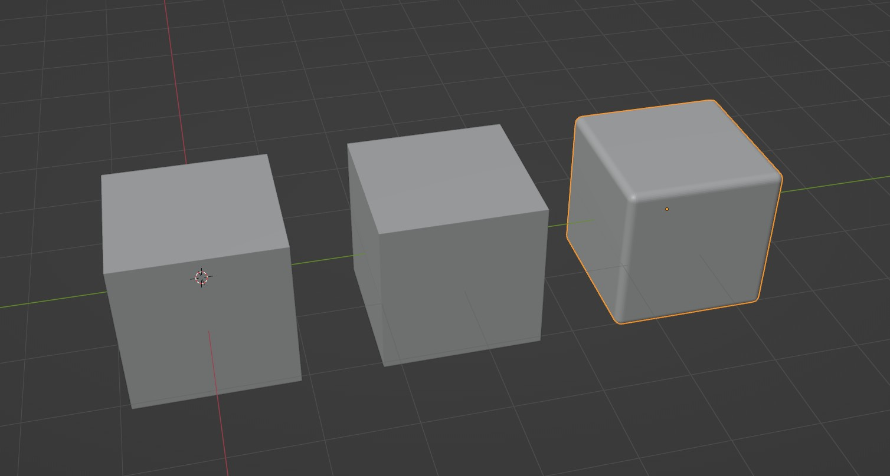

.. _modifier_sync:

===============
Modifier Sync
===============

The **Modifier Sync** tool copies the complete modifier stack from a source object to all of its linked duplicates (instances) throughout your scene. This ensures all instances of an object share the exact same modifiers.

It works with any object type that can have modifiers, including Meshes, Curves, and Text.

How to Use
==========

1. Select the object or objects you want to use as the source for your modifiers.
2. Run the **Modifier Sync** operator. The tool will copy the modifiers from each selected object to all of its linked duplicates (:kbd:`Alt+D` instances) in the entire scene.

.. important::
   If your selection includes multiple objects that share the same data (i.e., they are linked duplicates of each other), you must specify a source. To do this, simply make sure the object you want to copy modifiers *from* is the **active object** (selected last, with a brighter outline).

  A selection of linked duplicates with the source object active (brighter outline).

Selection Logic
===============

The operator is flexible, but follows a key rule:

* **Active Object Optional:** If your selection contains only unique objects (no linked duplicates of each other), an active object is **not required**. Each object acts as its own source.

* **Active Object Required:** If your selection contains multiple linked duplicates, the **active object is mandatory** and will be used as the single source for that entire instance group.

* **One Group at a Time:** Your selection cannot contain more than one group of linked duplicates (e.g., you cannot select two linked spheres *and* two linked cubes at the same time).
