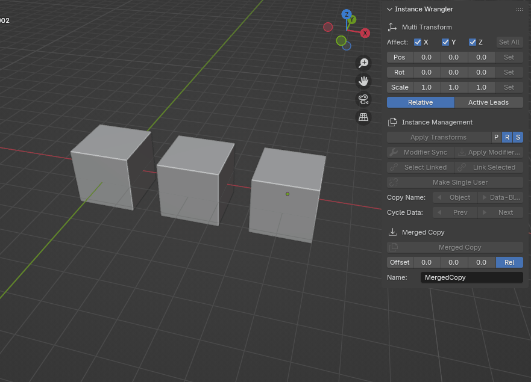
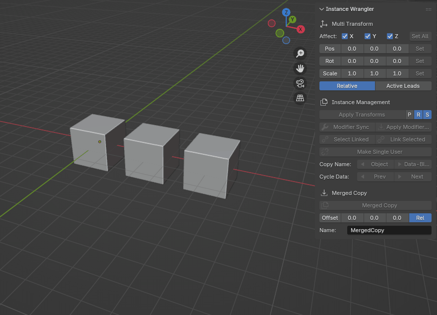

Multi Transform
===============

The **Multi Transform** panel provides a powerful and precise way to manipulate the position, rotation, and scale of multiple objects simultaneously. It's designed for workflows that demand accurate, numeric input, offering a level of control that goes beyond Blender's standard interactive tools.

The panel is organized into three rows for **Position**, **Rotation**, and **Scale**, each with its own numeric input fields and a **Set** button to apply the changes. These rows share a set of powerful controls that define how the transformations are applied, allowing the tool to operate in two distinct ways: a **Standard Mode** for editing objects independently, and a powerful **Active Leads Mode** which uses the active object as a group pivot.

UI Controls Explained
---------------------

* **Affect: X, Y, Z:** These checkboxes let you apply transforms to specific axes while ignoring others.
* **Set Button:** Applies the values from the numeric fields to all selected objects, respecting the mode settings.
* **Set All Button:** Applies the values for Position, Rotation, and Scale all at once.
* **Pos, Rot, Scale Buttons:** These are shortcuts to reset the numeric input fields next to them to their default values—``(0,0,0)`` for Position/Rotation and ``(1,1,1)`` for Scale.
* **Relative Toggle:** Switches between **Absolute** and **Relative** modes. Its behavior changes depending on whether **Active Leads** is enabled.
* **Active Leads Toggle:** Switches the tool to a powerful mode where the **active object** acts as a pivot or "fake parent" for the rest of the selection.

Standard Modes (Active Leads OFF)
---------------------------------

When **Active Leads** is disabled, the tool operates on each selected object independently.

* **Absolute Mode** (``Relative`` disabled): This mode sets the transform values to the **exact numbers** you enter. It's perfect for aligning objects to a specific coordinate.
    * *Example: To align all selected objects to a height of 5 meters, you would disable ``Relative``, enter ``5.0`` in the Z position field, and click **Set**.*

* **Relative Mode** (``Relative`` enabled): This mode **adds** (or multiplies for scale) the entered values to each object's current transform. It's ideal for nudging a selection of objects while preserving their existing arrangement.
    * *Example: To move all selected objects 2 units to the right, you would enable ``Relative``, enter ``2.0`` in the X position field, and click **Set**.*

Active Leads Mode (Active Leads ON)
-----------------------------------

Enabling **Active Leads** makes the **active object** the pivot point for the entire selection, like a lead dancer guiding their partners. The ``Relative`` toggle now switches between two powerful sub-modes.

Absolute Mode (Relative OFF): Transform as Children
^^^^^^^^^^^^^^^^^^^^^^^^^^^^^^^^^^^^^^^^^^^^^^^^^^^^^

In this mode, the entire selection behaves as if temporarily parented to the active object. You are setting an **absolute target** for the leader, and the followers will arrange themselves around it.

* **Position:** The entire group moves rigidly to place the active object at the target coordinates.
* **Rotation:** Followers **orbit** around the active object as it rotates to its new orientation.
* **Scale:** Followers move closer to or further away from the active object as it scales to its new size, maintaining the group's proportions.

Relative Mode (Relative ON): Incremental Parented Transform
^^^^^^^^^^^^^^^^^^^^^^^^^^^^^^^^^^^^^^^^^^^^^^^^^^^^^^^^^^^^^

In this mode, the UI values represent an **incremental change** that is applied to the active object, and the followers move with it in a parented fashion with each click.

* **Position:** The entire group moves by the specified amount.
* **Rotation:** The active object rotates on its axis by the specified degrees, and all followers **orbit** it by that same amount.
* **Scale:** The active object is scaled by the specified factor, and all followers scale with it, moving further from or closer to the leader proportionally.

Active Leads makes "followers" orbit around the active object.

Active Leads makes "followers" scale and move as if parented to the active object.
